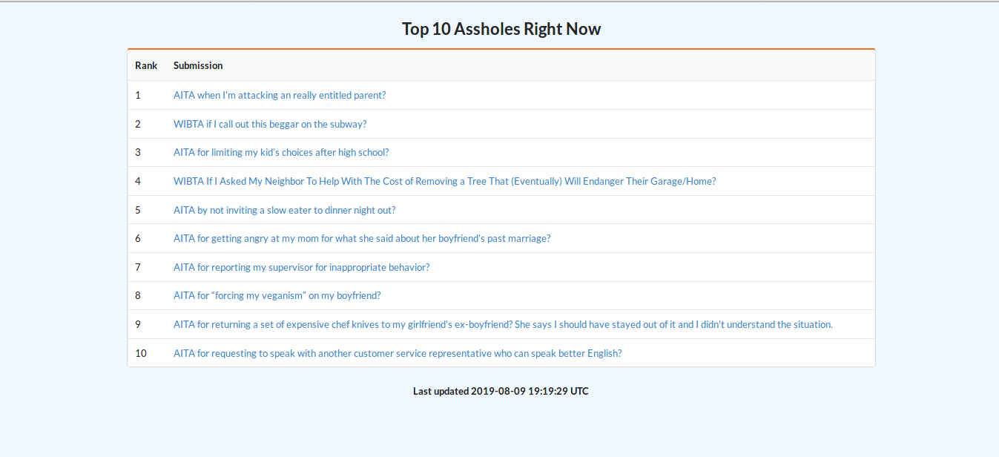

# reddit-aita-leaderboard

A real-time leaderboard displaying the worst of the worst right now on /r/AmITheAsshole.

### Requirements
Linux OS (not Mac!)
Docker version 17
docker-compose version 1.24

### Instructions

Clone this directory and then run:

`$ docker-compose up`

Navigate to `localhost:5000` in your web browser.

### Background

[/r/AmITheAsshole](https://www.reddit.com/r/AmItheAsshole/) is a forum hosted on [Reddit](https://www.reddit.com) where users can post about anything that happened in their lives, asking for judgement from fellow Redditors on whether or not they were the asshole in the situation. The moderators of the subreddit phrase it much more eloquently than I do:

> A catharsis for the frustrated moral philosopher in all of us, and a place to finally find out if you were wrong in an argument that's been bothering you.

According to the [rules of /r/AmITheAsshole](https://www.reddit.com/r/AmItheAsshole/wiki/faq), there are 5 possible judgements:
 - YTA: You're The Asshole
 - ESH: Everyone Sucks Here
 - NTA: Not The Asshole
 - NAH: No Assholes Here
 - INFO: Not Enough Info

Redditors can comment on a submission and must include one of the above acronyms in their comment. Reddit works with a voting system- each submission or comment can be 'upvoted' or 'downvoted'. 18 hours after a submission was posted, a bot makes a final judgement on that submission according to the comment with the most upvotes.

Just like everyone else on the internet, I am an outrage junkie. The posts that are most fun to read are usually the ones where the poster is judged to be at fault. It is quite straightforward to go back and find posts that are already tagged as "YTA" but I wanted to see the worst ones in real time. The foundation of Reddit is its voting system and you are pretty much restricted to viewing the latest posts sorted by some function of their votes, but I wanted to take the comments into consideration here.

### Design Notes

#### Data Ingestion
I am using the beautiful [PRAW](https://github.com/praw-dev/praw) library to make calls to the Reddit API and stream comments as they are created. Everything goes into a Redis database, in which I use the [sorted set](https://redis.io/commands#sorted_set) structure to take care of all the leaderboard logic. I am also using [hashes](https://redis.io/commands#hash) to cache submission data.

#### A-Hole Scoring System

As of the latest commit to this project, my scoring system is just counting the 'YTA' comments for each submission since the app was started. This is pretty simple metric with but I have not been disappointed with the results so far. Most posts on the leaderboard end up being outrageous enough for me, but there is definitely room for improvement.

#### Web App
The back-end is a Flask server that subscribes to a Redis channel where updates to the leaderboard are published. I am using Semantic UI to visualize the leaderboard on the front-end. The leaderboard does live updates and this is accomplished through WebSockets. The back-end uses the [Flask-SocketIO plugin](https://flask-socketio.readthedocs.io/en/latest/) and the front-end is using SocketIO + JQuery to update the data.
 
### TODO 
 - Comments and Clean-up: More and better comments! Clean up your code and do some refactoring, especially with the Flask app.
 - Docker Network: Right now I am using the [host network](https://docs.docker.com/network/host/) to build and run my services. This was because I was having issues connecting to the internet in my Docker containers. I need to figure out why those issues were happening and try to use the default network configuration. I especially need to fix this because the host network option only runs on Linux! 
 - Heroku Hosting: It would be super cool to deploy this app remotely.
 - Web App Container: I wanted to make installation of Semantic UI part of the Dockerfile for the leaderboard application but I could not get auto-installation working for it. It would be great to figure that out so I don't have to include all the Semantic UI files in my repo. 
 - Better logging: Logging is pretty weak right now. My data ingestion pipeline is publishing logs to Redis but logging should be abstracted out. I need to read more into logging with Docker. I need more logs for the Flask app as well.
 - Improvements to Reddit data ingestion: I should have smarter filtering of what comments and submissions I am considering. For example, I have seen some duplicate submissions on the leaderboard sometimes when someone made the same post again after deleting it.
 - More leaderboard options: I am only displaying the top 10 submissions but I can make it more flexible by allowing the user to choose how many submissions to display. I can also implement date filtering or keyword searching.
 - Advanced scoring model: Two approaches here. First is simply considering other functions of available data, like counting other judgements on a post as well. The second involes using NLP techniques to engineer more features like topic or sentiment. I can take this further and train a classifier on already tagged posts.  
